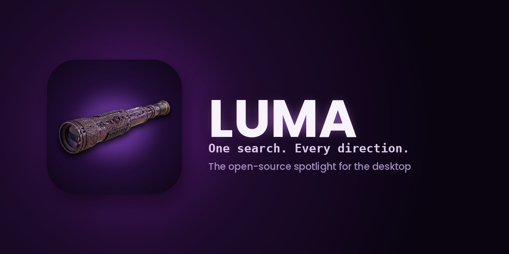
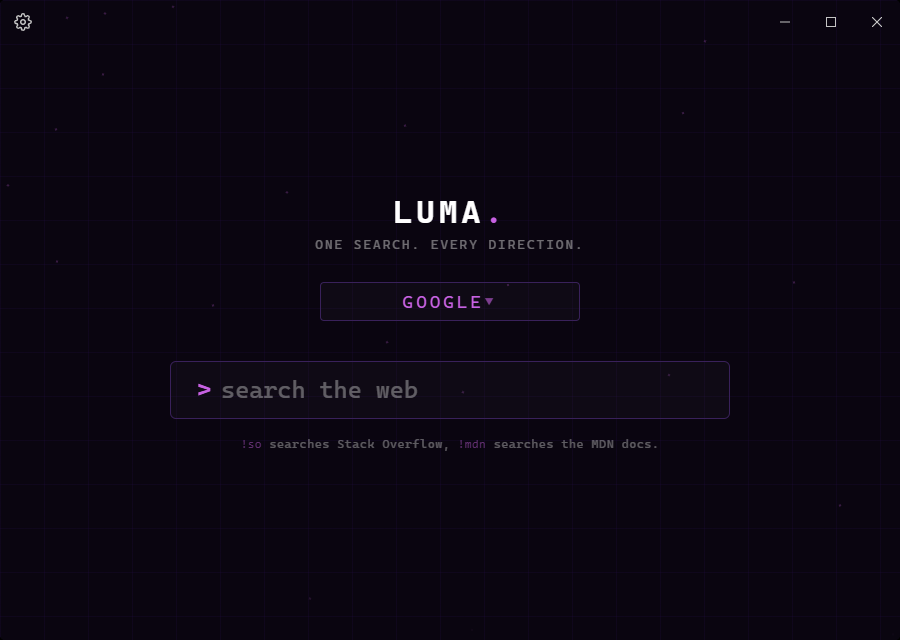
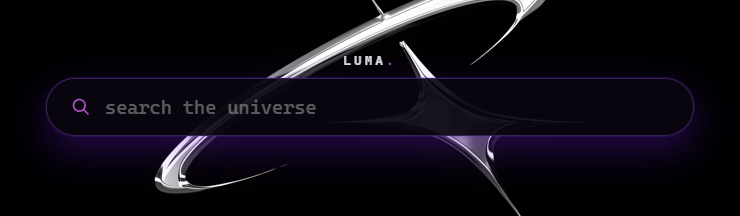

<p align="center">
  
</p>

<p align="center">
  <a href="../../releases"></a>
  <a href="LICENSE"></a>
  <a href="../../actions/workflows/ci.yml"></a>
  
  <a href="../../discussions"></a>
</p>

<p align="center">
  <b>LUMA</b> is a fast, open-source spotlight-style search launcher for
  Linux, macOS and Windows, built with <a href="https://tauri.app">Tauri</a>.
</p>

Type a plain query, or a `!bang` and a query to jump straight to one of
70+ search engines (Google, YouTube, GitHub, Wikipedia, Amazon, and
more), or to a file or app on your own machine with `!local` and
`!open`. Add your own engines and apps from Settings, or turn on any of
the built-in ones you want - only Google, Local and Open are on by
default, to keep the list uncluttered out of the box.

### Contents

- [Screenshots](#screenshots)
- [How it runs](#how-it-runs)
- [Features](#features)
- [Download](#download)
- [Documentation](#documentation)
- [Contributing](#contributing)
- [For developers](#for-developers) <sub>(build from source, project layout)</sub>
- [License](#license)

## Screenshots

<p align="center">
  
  <br><sub>Main window</sub>
</p>

<p align="center">
  
  <br><sub>Spotlight - summoned anywhere with a keyboard shortcut</sub>
</p>

## How it runs

It runs two ways:

- **Main window** - a normal resizable window, opened from the tray or
  your app launcher.
- **Spotlight** - press a keyboard shortcut (`Alt+Space` by default,
  changeable in Settings) anywhere on your desktop and a small,
  frameless search bar drops in near the top of the screen. Search, and
  it hides itself again.

Results open in your default browser, or in LUMA's own built-in browser
window if you'd rather stay inside the app - your choice, in Settings.

## Features

- **Bangs and custom search engines** - `!yt`, `!gh`, `!wiki`, and
  dozens more out of the box; add your own with any site that has a
  search URL. See the full list on the
  [Bangs and Search Engines](../../wiki/Bangs-and-Search-Engines) wiki
  page.
- **`!local` and `!open`** - search your own machine's files, or launch
  an installed app by name, without leaving the keyboard.
- **Themes and a one-click marketplace** - switch themes instantly from
  Settings, install community themes from the marketplace with one
  click (with paging once there are more than a handful), or drop in
  your own `theme.css` (with custom CSS on top, if you want to go
  further).
- **Plugins** - quick-answer bangs like `@time` and `@date` that run a
  small piece of JS instead of opening a search, installed the same
  three ways as themes (marketplace, URL, or by hand).
- **A real auto-updater** - LUMA checks GitHub for a newer build and
  installs it itself; no separate download, no installer to re-run.
- **Advanced logging & a live debug console** - off by default and
  fully inert while off; turn it on and get a detailed, timestamped log
  of everything LUMA does, both live in an in-app console (with a live
  RAM/process panel) and in a rotating file on disk.
- **Localization** - the interface is available in English and Dutch,
  with live language switching and a community-editable locale file, so
  adding a new language is one file, not a rebuild.
- **A custom, Discord-style titlebar and install flow** - LUMA looks and
  installs the same, consistent way on every platform, no OS chrome.

## Download

Grab a prebuilt executable from the
[Releases page](../../releases) - one file per platform, no installer.

<p align="center">
  <a href="../../releases/latest/download/luma-linux-x64"></a>
  <a href="../../releases/latest/download/luma-macos-arm64"></a>
  <a href="../../releases/latest/download/luma-macos-x64"></a>
  <a href="../../releases/latest/download/luma-windows-x64.exe"></a>
</p>

| Platform | File |
|---|---|
| Linux | `luma-linux-x64` |
| macOS (Apple Silicon) | `luma-macos-arm64` |
| macOS (Intel) | `luma-macos-x64` |
| Windows | `luma-windows-x64.exe` |

On Linux and macOS you'll need to make it executable first:

```bash
chmod +x luma-linux-x64
./luma-linux-x64
```

On macOS, don't double-click the app the first time. Right-click it (or
Control-click) and choose "Open" instead, then confirm in the dialog that
pops up. After that first launch, it opens normally from then on.

Full first-run and uninstall details are on the
[Installation](../../wiki/Installation) wiki page.

## Documentation

The full docs live on the [wiki](../../wiki):

- [Installation](../../wiki/Installation) - prebuilt binaries and
  building from source, in more detail
- [Configuration](../../wiki/Configuration) - every `config.toml` field,
  explained
- [Theming](../../wiki/Theming) - build and install your own CSS theme,
  or publish one to the marketplace
- [Plugins](../../wiki/Plugins) - quick-answer bangs like `@time`,
  installing them, and writing your own
- [Bangs and Search Engines](../../wiki/Bangs-and-Search-Engines) - the
  `!bang` system, the full built-in engine table, and how to add your
  own
- [Logging and Diagnostics](../../wiki/Logging-and-Diagnostics) - the
  advanced logging system, log format, and debug console
- [Community Translations](../../wiki/Community-Translations) - add a
  new language in one file
- [Contributing](../../wiki/Contributing) - dev setup, pre-PR checks,
  and where things live

## Contributing

Bug reports, feature ideas and theme submissions all have their own
issue template - open one from the
[Issues](../../issues/new/choose) page. General questions and
open-ended discussion belong in
[Discussions](../../discussions) instead of an issue.

Want to change code? See [Contributing](../../wiki/Contributing) on the
wiki, and the [For developers](#for-developers) section below to get a
build running locally.

## For developers

Building from source, the full project layout, and a deep-dive into
every internal system now live on the wiki's
[Contributing / Developer Guide](../../wiki/Contributing) - not needed
if you just want to run LUMA. Short version: you'll need
[Rust](https://rustup.rs) and Node.js 18+ (Node only runs the Tauri CLI,
the app itself has no JS runtime dependency), then:

```bash
npm install
npm run dev     # run it with hot reload
npm run build   # produce a release binary at src-tauri/target/release/luma
```

## License

[MIT](LICENSE) - do whatever you like with it, forks included.
