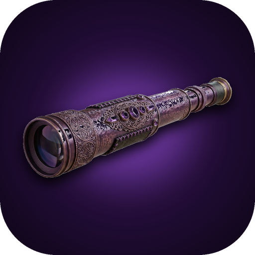

<p align="center">
  
</p>

<h1 align="center">LUMA</h1>

<p align="center">One search. Every direction.</p>

LUMA is a fast, open-source spotlight-style search launcher for Linux,
macOS and Windows, built with [Tauri](https://tauri.app). Type a plain
query, or a `!bang` and a query to jump straight to one of 70+ search
engines (Google, YouTube, GitHub, Wikipedia, Amazon, and more), or to a
file or app on your own machine with `!mypc` and `!open`. Add your own
engines and apps from Settings, or turn on any of the built-in ones you
want - only Google, MyPC and Open are on by default, to keep the list
uncluttered out of the box.

It runs two ways:

- **Main window** - a normal resizable window, opened from the tray or
  your app launcher.
- **Spotlight** - press a keyboard shortcut (`Alt+Space` by default,
  changeable in Settings) anywhere on your desktop and a small, frameless
  search bar drops in near the top of the screen. Search, and it hides
  itself again.

Results open in your default browser, or in LUMA's own built-in browser
window if you'd rather stay inside the app - your choice, in Settings.

## Features

- **Bangs and custom search engines** - `!yt`, `!gh`, `!wiki`, and dozens
  more out of the box; add your own with any site that has a search URL.
- **`!mypc` and `!open`** - search your own machine's files, or launch an
  installed app by name, without leaving the keyboard.
- **Themes and a one-click marketplace** - switch themes instantly from
  Settings, install community themes from the marketplace with one click,
  or drop in your own `theme.css` (with custom CSS on top, if you want to
  go further).
- **A real auto-updater** - LUMA checks GitHub for a newer build and
  installs it itself; no separate download, no installer to re-run.
- **Advanced logging & a live debug console** - off by default and fully
  inert while off; turn it on and get a detailed, timestamped log of
  everything LUMA does, both live in an in-app console (with a live
  RAM/process panel) and in a rotating file on disk.
- **Localization** - the interface is available in English and Dutch,
  with live language switching and a community-editable locale file, so
  adding a new language is one file, not a rebuild.
- **A custom, Discord-style titlebar and install flow** - LUMA looks and
  installs the same, consistent way on every platform, no OS chrome.

## Download

Grab a prebuilt executable from the
[Releases page](../../releases) - one file per platform, no installer.

- Linux: `luma-linux-x64`
- macOS (Apple Silicon): `luma-macos-arm64`
- macOS (Intel): `luma-macos-x64`
- Windows: `luma-windows-x64.exe`

On Linux and macOS you'll need to make it executable first:

```bash
chmod +x luma-linux-x64
./luma-linux-x64
```

macOS binaries aren't notarized (that costs an Apple developer account),
so the first time you open one, right-click it and choose "Open" to get
past Gatekeeper, instead of double-clicking.

## Building from source

You'll need [Rust](https://rustup.rs) and Node.js 18+ (Node is only used
for the Tauri CLI, not the app itself). On Linux you also need the
platform packages from Tauri's
[prerequisites guide](https://tauri.app/start/prerequisites/) -
`libwebkit2gtk-4.1-dev`, `libgtk-3-dev`, `libayatana-appindicator3-dev`,
`librsvg2-dev`, and `build-essential`.

```bash
npm install
npm run dev     # run it with hot reload
npm run build   # produce a release binary at src-tauri/target/release/luma
```

`npm run build` just runs `cargo build --release` under the hood (via the
Tauri CLI) - there's no installer bundling step, so the output is a
single binary you can run directly, same as what the Releases page ships.

## How it's laid out

```
src-tauri/            Rust backend
  src/
    main.rs              entry point, plugin/tray/shortcut wiring
    config.rs             config.toml load/save, seeds built-in themes
    themes.rs              discovers themes in the user's themes folder
    marketplace.rs           fetches/installs/uninstalls marketplace themes
    locales.rs                loads locale files, English-fallback merge
    logging.rs                  advanced logging + live RAM/process info
    updater.rs                    checks for and installs new releases
    install.rs                     first-run relocate + shortcut creation
    window.rs                       spotlight / main / built-in-browser windows
    shortcuts.rs                     registers the global hotkey
    tray.rs                           tray icon + menu
    commands.rs                        the frontend calls these via invoke()
  resources/            built-in engines, default theme, and locale files -
                          compiled directly into the binary, so a
                          downloaded executable needs no other files
  capabilities/          Tauri permission grants
marketplace/           community theme catalog (index.json + theme folders)
src/                  frontend - plain HTML/CSS/JS, no bundler
  index.html             the search UI (used for both windows)
  settings.html            the settings page
  i18n.js                    loads and applies locale strings
  debug-log.js                 the in-app debug console
  vendor/engine/                 bangdeck.js (bang parsing) and ui.js
                                   (search box behavior)
```

## Documentation

The full docs live on the [wiki](../../wiki):

- [Installation](../../wiki/Installation) - prebuilt binaries and building from source, in more detail
- [Configuration](../../wiki/Configuration) - every `config.toml` field, explained
- [Theming](../../wiki/Theming) - build and install your own CSS theme, or publish one to the marketplace
- [Bangs and Search Engines](../../wiki/Bangs-and-Search-Engines) - the `!bang` system and how to add engines
- [Logging and Diagnostics](../../wiki/Logging-and-Diagnostics) - the advanced logging system, log format, and debug console
- [Community Translations](../../wiki/Community-Translations) - add a new language in one file
- [Contributing](../../wiki/Contributing) - dev setup, pre-PR checks, and where things live

## License

[MIT](LICENSE) - do whatever you like with it, forks included.
