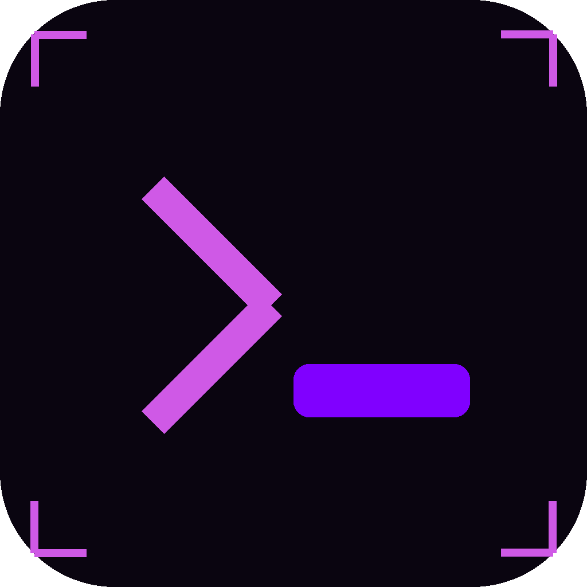

<p align="center">
  
</p>

# Luma

Luma is a spotlight-style search launcher for Linux, macOS and Windows,
built with [Tauri](https://tauri.app). Its search box is called
**BangDeck** - type a plain query, or a `!bang` and a query to jump
straight to one of about 70 search engines (Google, YouTube, GitHub,
Wikipedia, Amazon, and so on).

It runs two ways:

- **Main window** - a normal resizable window, opened from the tray or
  your app launcher.
- **Spotlight** - press a keyboard shortcut (`Alt+Space` by default,
  changeable in Settings) anywhere on your desktop and a small, frameless
  search bar drops in near the top of the screen. Search, and it hides
  itself again.

Results open in your default browser, or in Luma's own built-in browser
window if you'd rather stay inside the app - your choice, in Settings.

## Download

Grab a prebuilt executable from the
[Releases page](../../releases) - one file per platform, no installer.

- Linux: `luma-linux-x64`
- macOS (Apple Silicon): `luma-macos-arm64`
- macOS (Intel): `luma-macos-x64`
- Windows: `luma-windows-x64.exe`

On Linux and macOS you'll need to make it executable first:

```bash
chmod +x luma-linux-x64
./luma-linux-x64
```

macOS binaries aren't notarized (that costs an Apple developer account),
so the first time you open one, right-click it and choose "Open" to get
past Gatekeeper, instead of double-clicking.

## Building from source

You'll need [Rust](https://rustup.rs) and Node.js 18+ (Node is only used
for the Tauri CLI, not the app itself). On Linux you also need the
platform packages from Tauri's
[prerequisites guide](https://tauri.app/start/prerequisites/) -
`libwebkit2gtk-4.1-dev`, `libgtk-3-dev`, `libayatana-appindicator3-dev`,
`librsvg2-dev`, and `build-essential`.

```bash
npm install
npm run dev     # run it with hot reload
npm run build   # produce a release binary at src-tauri/target/release/luma
```

`npm run build` just runs `cargo build --release` under the hood (via the
Tauri CLI) - there's no installer bundling step, so the output is a
single binary you can run directly, same as what the Releases page ships.

## How it's laid out

```
src-tauri/            Rust backend
  src/
    main.rs              entry point, plugin/tray/shortcut wiring
    config.rs             config.toml load/save, seeds the default theme
    themes.rs               discovers themes in the user's themes folder
    window.rs                 spotlight / main / built-in-browser windows
    shortcuts.rs               registers the global hotkey
    tray.rs                     tray icon + menu
    commands.rs                   the frontend calls these via invoke()
  resources/            the built-in engine list and default theme -
                          compiled directly into the binary, so a
                          downloaded executable needs no other files
  capabilities/          Tauri permission grants
src/                  frontend - plain HTML/CSS/JS, no bundler
  index.html             the search UI (used for both windows)
  settings.html            the settings page
  vendor/engine/             bangdeck.js (bang parsing) and ui.js (search
                              box behavior)
```

## Documentation

The full docs live on the [wiki](../../wiki):

- [Installation](../../wiki/Installation) - prebuilt binaries and building from source, in more detail
- [Configuration](../../wiki/Configuration) - every `config.toml` field, explained
- [Theming](../../wiki/Theming) - build and install your own CSS theme
- [Bangs and Search Engines](../../wiki/Bangs-and-Search-Engines) - the `!bang` system and how to add engines
- [Contributing](../../wiki/Contributing) - dev setup, pre-PR checks, and where things live

## License

[MIT](LICENSE) - do whatever you like with it, forks included.
